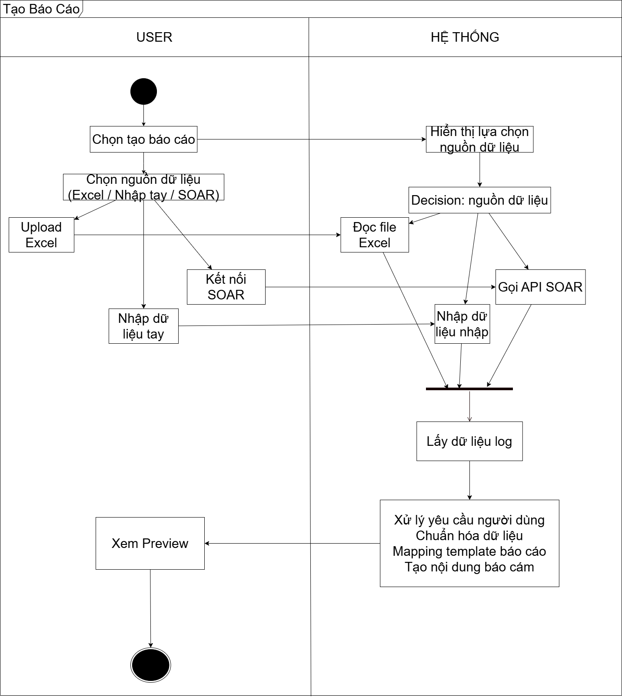

# CREATE REPORT WORKFLOW

---

## USER FLOW
1. User chọn tạo báo cáo
2. Chọn nguồn dữ liệu:
   - Excel
   - Nhập tay
   - SOAR (mock)

---

## SYSTEM FLOW

### Excel
3. Upload file Excel
4. Đọc file Excel

### Nhập tay
5. Nhận dữ liệu nhập

### SOAR
6. Gọi API SOAR (mock)

---

## PROCESS
7. Tổng hợp dữ liệu
8. Lấy dữ liệu log
9. Xử lý:
   - Chuẩn hóa dữ liệu
   - Mapping template
   - Tạo nội dung báo cáo

---

## RESULT
10. Hiển thị preview