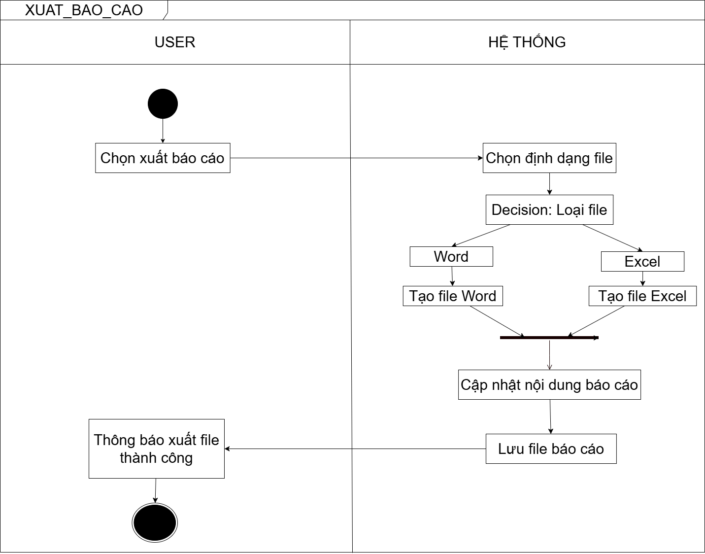

# EXPORT REPORT WORKFLOW

---

## USER FLOW
1. User chọn xuất báo cáo

---

## SYSTEM FLOW
2. Chọn định dạng file:
   - Word
   - Excel

---

## PROCESS

### Nếu Word
3. Tạo file Word (.docx)

### Nếu Excel
4. Tạo file Excel (.xlsx)

---

## FINAL
5. Cập nhật nội dung báo cáo
6. Lưu file vào server
7. Trả kết quả thành công

---

## RESULT
8. User nhận thông báo xuất file thành công