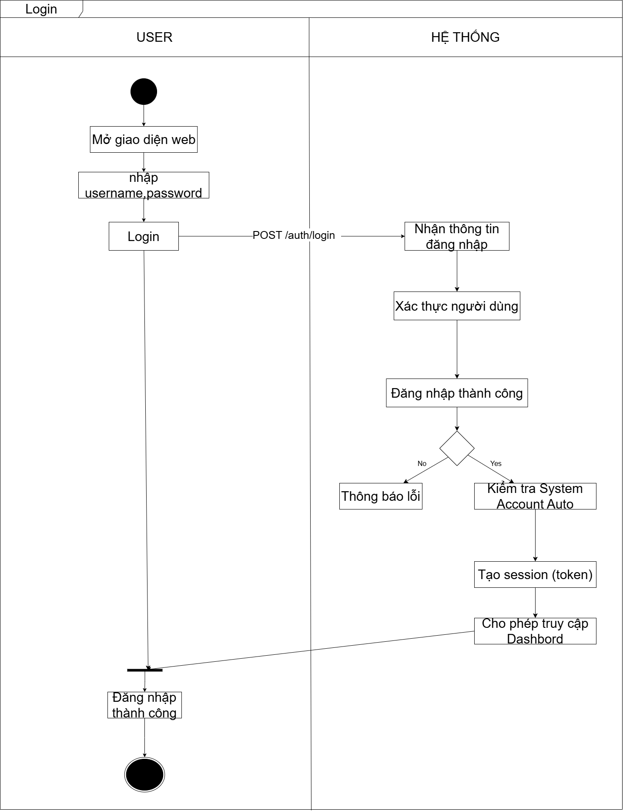

# LOGIN WORKFLOW

---

## USER FLOW
1. User mở giao diện web
2. Nhập username và password
3. Click nút Login

---

## SYSTEM FLOW
4. Gửi request POST /auth/login
5. Hệ thống nhận thông tin đăng nhập
6. Xác thực người dùng

---

## DECISION

### Nếu đăng nhập thất bại
7. Trả về thông báo lỗi

### Nếu đăng nhập thành công
8. Kiểm tra System Account Auto
9. Tạo session (JWT token)
10. Cho phép truy cập Dashboard

---

## RESULT
11. User đăng nhập thành công