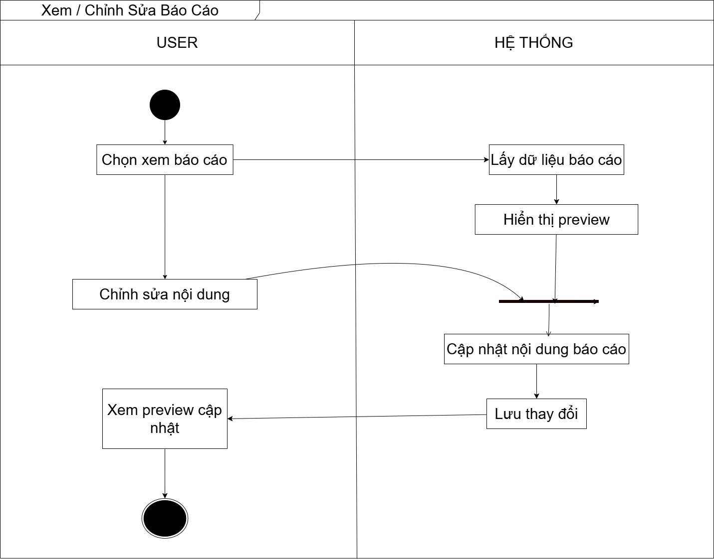

# VIEW / EDIT REPORT WORKFLOW

---

## USER FLOW
1. User chọn xem báo cáo
2. Xem preview
3. Chỉnh sửa nội dung

---

## SYSTEM FLOW
4. Lấy dữ liệu báo cáo từ DB
5. Hiển thị preview

---

## UPDATE FLOW
6. User gửi nội dung chỉnh sửa
7. Cập nhật nội dung báo cáo
8. Lưu thay đổi vào DB

---

## RESULT
9. Hiển thị preview đã cập nhật