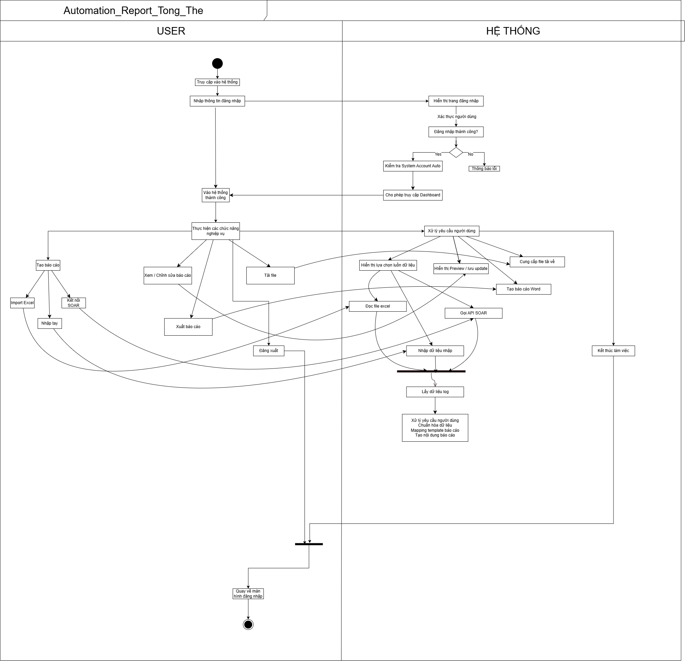

# SYSTEM WORKFLOW (TỔNG THỂ)

---

## FLOW CHÍNH

1. User truy cập hệ thống
2. Đăng nhập

---

## SAU KHI LOGIN

User có thể:

### 1. Tạo báo cáo
- Import Excel
- Nhập tay
- SOAR (mock)

---

### 2. Xem / chỉnh sửa báo cáo
- Xem preview
- Cập nhật nội dung

---

### 3. Xuất báo cáo
- Word / Excel

---

### 4. Tải file
- Download từ server

---

## SYSTEM PROCESS

- Xử lý dữ liệu
- Mapping template
- Generate nội dung
- Lưu DB
- Tạo file export

---

## END
- User hoàn thành công việc
- Có thể logout