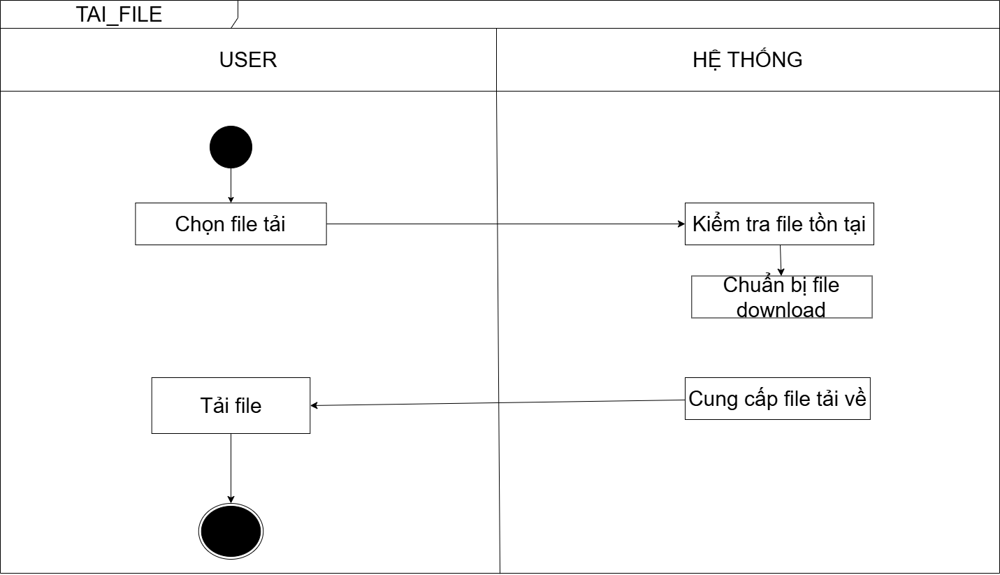

# DOWNLOAD FILE WORKFLOW

---

## USER FLOW
1. User chọn file cần tải

---

## SYSTEM FLOW
2. Kiểm tra file có tồn tại không

### Nếu không tồn tại
3. Trả lỗi

### Nếu tồn tại
4. Chuẩn bị file download
5. Stream file về client

---

## RESULT
6. User tải file thành công